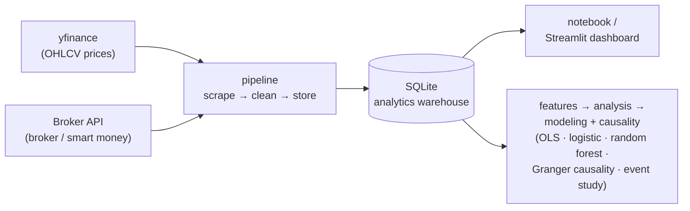
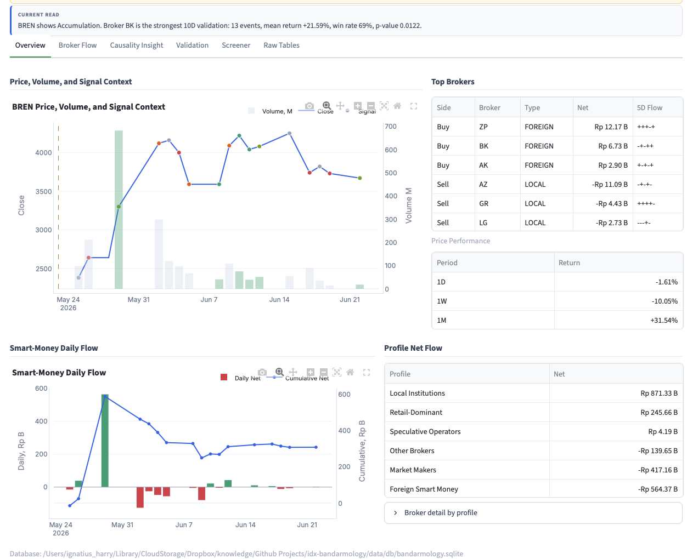
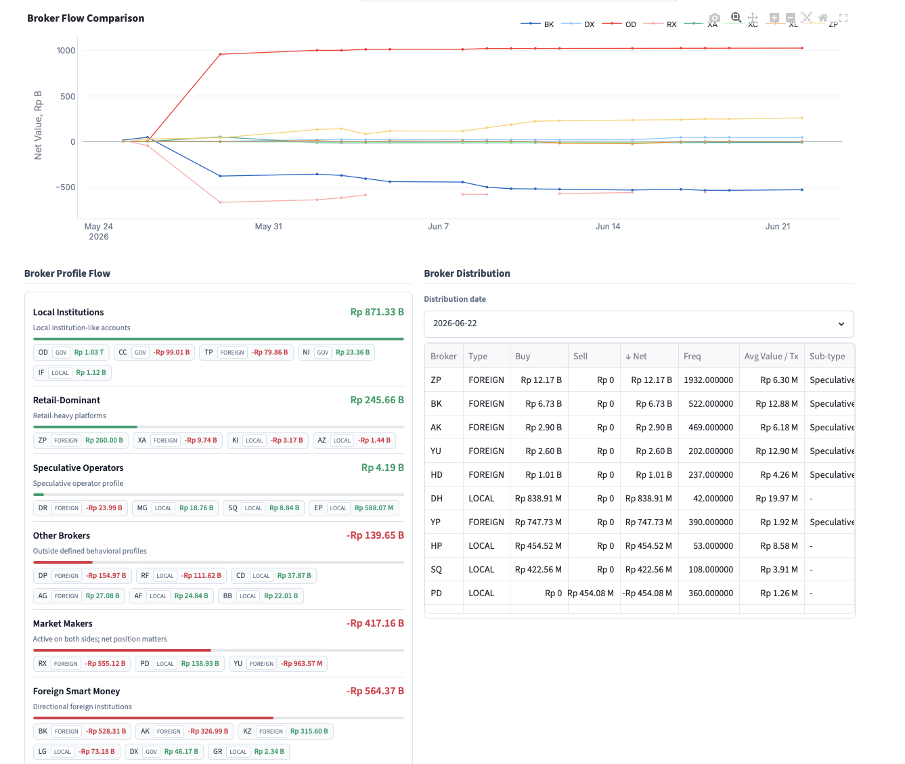

# 📈 IDX Bandarmology — Smart Money Tracker for Indonesian Stocks

An end-to-end data pipeline for testing a simple question:

> **Do large-broker accumulation signals and foreign flow actually align with stronger IDX stock returns, or are they mostly trader folklore?**

The project is built around a notebook-first workflow, with a separate Streamlit dashboard for interactive exploration and portfolio-ready screenshots.

---

## What this project demonstrates

A single, end-to-end project that exercises the **full data lifecycle** — built to show practical **Data Engineering**, **Data Analysis**, and **Data Science** skills in one place.

| Role | What I built here |
|------|-------------------|
| 🛠️ **Data Engineer** | End-to-end **ETL pipeline** ingesting two live sources (yfinance OHLCV + an authenticated broker-flow API), cleaning and landing them into a **SQLite analytics warehouse**; **incremental multi-day backfill** that turns broker *snapshots* into a time series; a modular, reusable Python package (`config` · `broker_api` · `prices` · `storage` · `pipeline` · `features`) with secrets handled via `.env`. |
| 📊 **Data Analyst** | A **5-tab interactive Streamlit dashboard** with KPI cards, filters and drill-downs; **visual storytelling** (price/signal overlays, broker flow, distribution, event studies); business framing that turns anonymous broker codes into *"who is actually accumulating"*; plus a portfolio-ready [static HTML preview](docs/dashboard-preview.html). |
| 🔬 **Data Scientist** | **Feature engineering** (forward/backward returns, smart-money features); **statistical inference** (OLS with HAC/Newey–West robust errors, one-sided significance tests with multiple-testing awareness); **Granger causality** for lead/lag (statsmodels); **classification models** (logistic regression & random forest) scored with precision, recall & ROC-AUC; and an **event-study** framework. |

**Tech stack:** Python · pandas · NumPy · statsmodels · scikit-learn · SQLite · Streamlit · matplotlib · yfinance · Jupyter

## The story behind this project

It started with a question every Indonesian retail investor eventually asks: **does "smart money" really exist on the IDX, or is *bandarmology* just folklore?**

I went looking with **BULL** (PT Buana Lintas Lautan). The fundamentals were already interesting — after taking delivery of its first LNG carrier (MT Gas Garuda, 145,914 CBM) in December 2025, BULL planned three more LNG vessels in H2 2026 (~US$125M capex) into a market expected to need 140–155 new LNG carriers by 2027, with sell-side targets implying meaningful upside.

But the **data** was more interesting. My dashboard flagged BULL with an **Accumulation** signal, a **conviction score of 60.9/100**, and **+4.35% (5D) / +28.86% (10D)** forward returns — yet **foreign net flow was still negative.**

That left one question:

> **If the price is rising but foreign money isn't behind it, who is actually buying?**

Rather than guess, I built a pipeline to track it broker-by-broker. One code stood out: **II**, with **more than Rp 105 B cumulative net buy** over the window — a patient accumulator that kept adding while others sold. Public broker-code references map **II → PT Danatama Makmur Sekuritas**, a firm with a *reported corporate affiliation* to BULL's controlling owners. (A broker code only identifies the executing firm, not the end client — this is a research lead, **not** an accusation.)

That curiosity became this end-to-end project, following one loop:

> **raw data → SQLite warehouse → dashboard → insight → testable hypothesis**

- a **data pipeline** that collects, cleans, transforms and stores price + broker-flow data in SQLite;
- a **Streamlit dashboard** that visualises price, accumulation/distribution, broker grouping and smart-money signals;
- **feature engineering + statistical/ML validation** that tests whether broker accumulation is actually followed by forward returns.

And the first real lesson it taught me: **the biggest broker is not the most predictive one.** On BULL, II was the most *persistent* buyer — but statistically a much smaller broker (**GA**) carried the stronger, significant forward-return signal. Both stories are in the case studies below.

> Not financial advice and not a buy/sell recommendation — a data project and research case study.

## Architecture



Each module is intentionally small and reusable on its own under `src/idx_bandarmology/`.

## Repository structure

```text
idx-bandarmology/
├── .env.example
├── requirements.txt
├── notebooks/
│   └── 01_bandarmology_end_to_end.ipynb
├── dashboard/
│   └── app.py
├── src/idx_bandarmology/
│   ├── config.py
│   ├── broker_api.py
│   ├── prices.py
│   ├── storage.py
│   ├── pipeline.py
│   ├── features.py
│   ├── analysis.py
│   └── modeling.py
└── data/
    ├── raw/
    ├── processed/
    └── db/bandarmology.sqlite
```

## Setup

```bash
git clone <your-repo-url>
cd idx-bandarmology
python -m venv .venv
source .venv/bin/activate
pip install -r requirements.txt

cp .env.example .env
```

Then edit `.env` and set `BROKER_API_TOKEN`.

## Main workflow: notebook

```bash
jupyter notebook notebooks/01_bandarmology_end_to_end.ipynb
```

Run the notebook from top to bottom. It covers:

1. Pipeline execution with yfinance and the broker-flow endpoint.
2. Raw table inspection from SQLite.
3. Feature engineering.
4. Descriptive analysis and correlation checks.
5. OLS regression and simple classification models.
6. A plain-English verdict summary.

Edit the watchlist in the notebook to track different stocks:

```python
WATCHLIST = ["BBCA", "BBRI", "BMRI", "BBNI", "TLKM", "ASII", "UNVR", "GOTO", "BREN", "ANTM"]
```

Important: the broker-flow endpoint provides a latest snapshot, not a historical archive. To build a usable time series, run the pipeline on multiple trading days.

## Dashboard

```bash
streamlit run dashboard/app.py
```

The dashboard reads the same SQLite warehouse as the notebook, so both views stay in sync. From the sidebar you choose a **universe**, a **focused ticker**, an **analysis date**, a **lookback window**, and the **validation horizon** / **minimum-event** thresholds — and can trigger a fresh pipeline run or a historical backfill in place. Headline metric cards (close, 5D / 10D return, aggregate signal, smart-money cumulative flow) sit above five tabs:

- **Overview** — price-and-signal context chart for the focused ticker, the selected date's top net buyers and sellers, and the broker profile flow.
- **Broker Flow** — smart-money cumulative daily flow, multi-timeframe price performance, and the single-day broker distribution.
- **Causality Insight** — Granger-causality tests for whether foreign flow (in aggregate, by participant type, and broker-by-broker) statistically *leads* price.
- **Validation** — the broker-specific return validation table (events, mean/median forward return, win rate, net buy, significance) plus an accumulation event-study chart.
- **Raw Tables** — the underlying window-level broker-flow and broker-activity rows.

**No Python install?** Open [`docs/dashboard-preview.html`](docs/dashboard-preview.html) for a static, self-contained gallery of the live dashboard's BBCA and BULL views.

## Broker behavioral profiles — smart money vs. retail

Raw broker codes are anonymous, so before anything else the pipeline **groups every executing broker into a behavioral profile** and then nets their flow by group. This is what powers the *"who is really accumulating?"* read — separating conviction money from the crowd:

| Profile | What it represents |
|---------|--------------------|
| 🟢 **Foreign Smart Money** | Directional foreign institutions with higher conviction |
| 🔵 **Local Institutions** | Local funds and institution-like accounts |
| 🟣 **Market Makers** | Active on both sides — the *net* position is what matters |
| 🟠 **Speculative Operators** | Higher-risk, momentum / "gorengan"-style participants |
| ⚪ **Retail-Dominant** | Retail-heavy platforms, often late or contrarian |

In the dashboard, **"Smart Money" = Foreign Smart Money + Local Institutions**. The Overview tab's **Broker profile flow** panel shows net buy/sell for each group on the selected day, and the Broker-Flow tab's **Smart-money daily flow** chart sums only those two smart-money groups.

> These are **heuristic behavioral buckets** inferred from broker-code patterns, not official classifications — they describe how a desk *tends* to trade, not the identity of any end client.

## Results

Three worked examples, produced by the **same pipeline** against the same SQLite warehouse: **BREN** (Barito Renewables — the statistically strongest case), **BULL** (PT Buana Lintas Lautan — the origin story above), and **BBCA** (Bank Central Asia). Analysing any other stock is just a matter of changing the focused ticker.

### Headline case study — BREN has the strongest validated broker signal

**BREN** (Barito Renewables) is the cleanest *statistical* win in the warehouse. It is up **+31.54% over the past month**, and the dashboard tags it **Accumulation** — but the real headline sits in the **Validation** tab. Among every broker that has repeatedly net-bought BREN, foreign broker **BK** is the most statistically reliable accumulator: **13 net-buy events, a +21.59% average 10-day forward return, a 69% win rate, and p = 0.0122** (significant at the 5% level). That is exactly the signal this project was built to separate from noise.



The Overview reads top-to-bottom the way a desk would: the **price / volume / signal** chart, the day's **top net buyers and sellers** (here the three biggest buyers — **ZP, BK, AK** — are all *foreign* desks), recent **price performance** (+31.54% in a month), and the **smart-money daily flow** turning net-positive into the move.

This is where the **broker grouping** earns its keep. Instead of leaving 40+ anonymous broker codes on the screen, the pipeline nets them into behavioral profiles, so you can see *which kind of money* is on each side:



Over this window **Local Institutions** were the dominant net buyers (**+Rp 871 B**), with retail-heavy platforms adding **+Rp 245 B**, while **Market Makers (−Rp 417 B)** and **Foreign Smart Money (−Rp 564 B)** were net sellers — a reminder that an "Accumulation" tape can still have large foreign desks distributing underneath it. The point isn't a buy or sell call; it is that the same stock looks completely different once you split the flow by *who* is trading.

### BULL — when the aggregate signal misleads

Point the same pipeline at **BULL** (243 price rows, 105 broker-flow rows, 3,353 broker-activity rows in this window) and it tells the *opposite* kind of story — one where the aggregate label fights the move and the real edge hides one level down, in individual broker behaviour.

BULL did the opposite of what its headline signal said: the stock rose **+17.18% in 5 days** and **+15.06% in 10 days**, yet its overall "bandar" verdict read **Strong Distribution** ("big players selling"). In the chart — price on top, buy/sell dots below — that one-line summary was pointing the wrong way the whole time. The real signal was hiding one level deeper, in what *individual* brokers were doing.


### Not all brokers are equal — volume ≠ skill

Ranking every broker by *how its repeated net-buying of BULL was followed by forward returns* (≥5 events, positive mean, one-sided p < 0.05 to flag as significant) separates real edge from noise. The highest-**volume** brokers turned out to be the least predictive:

| Broker | Net-buy events | Win rate | Mean 10-day fwd return | p-value | Significant? |
|--------|:---:|:---:|:---:|:---:|:---:|
| **GA** | 11 | **73%** | **+15.48%** | **0.0053** | ✅ yes |
| II | 38 | 50% | +3.77% | 0.0642 | ❌ no |
| ZP | 37 | 46% | — | 0.1171 | ❌ no |
| SQ | 35 | 49% | — | 0.0822 | ❌ no |

> Lower-volume broker **GA** carried a genuine, statistically significant edge (p = 0.0053 ≈ 99.5% confidence), while the three biggest-volume brokers on the stock (II, ZP, SQ) had roughly coin-flip win rates. Across the whole watchlist, **17 broker–ticker combinations** passed the significance filter.


Think of this chart as a **scoreboard**: it ranks each broker by whether their buying was *actually* followed by price gains, automatically separating brokers with a real track record from the ones that are just noise.

### Who keeps buying BULL? Connecting the flow to the "bandar"

Look past win rate for a second and just ask *who shows up over and over*. Broker code **II** net-bought BULL on **38 separate trading days** in this window — by far the most **persistent** accumulator on the stock. It is the steadily climbing red (II) line in the broker-flow chart below: it keeps adding even while price chops sideways and other brokers flip in and out. That relentless, price-insensitive buying is the classic fingerprint of a **"bandar"** — a large, patient operator quietly building a position rather than chasing momentum.

So who is behind that code? Public broker-code references map **II** to **PT Danatama Makmur Sekuritas**. Based on publicly reported board compositions and shareholder disclosures, this brokerage and the issuer (BULL) share a **reported corporate affiliation** — overlapping membership of the same controlling family at board level, and Danatama-linked entities listed on BULL's public shareholder register. (Reported public-record relationships; confirm current details against the latest exchange filings.)

> **The hypothesis this surfaces:** the most persistent "bandar" accumulating BULL is routing through a broker **affiliated with BULL's own controlling owners** — i.e. the patient smart money on this stock may be connected to the insiders themselves. That is a striking, *testable* lead that the pipeline produced automatically from raw broker codes.

> ⚠️ **Observational hypothesis, not an allegation.** A broker code identifies the *executing member firm*, not the end client, so it cannot prove who actually traded — many unrelated clients can route orders through the same broker. There is **no public evidence** that any specific director or insider placed these trades. The value here is methodological: broker-flow data turned an anonymous code into a named, affiliated counterparty worth investigating with proper disclosures.


Each line is one broker's running total of buying. A line that just keeps climbing is a player quietly building a big position day after day — the classic fingerprint of a **"bandar"** (a large operator).

### Event study: what happens after an accumulation signal?

Just like the BBCA version, this lines up every buy signal at day 0 (= 100) and tracks the price for the next 10 days, with the **average path** in black. For BULL the average stays **above 100** through the first 5 days — a short-lived bump after the buying, rather than a lasting trend.


### Broker distribution snapshot

A single day's snapshot of who bought (green) versus who sold (red), broker by broker — the cast of characters behind that day's signal.


> Scope & reproducibility: these are a snapshot from the BULL analysis (2026-03-31 → 2026-06-19) produced by `notebooks/01_bandarmology_end_to_end.ipynb` and `dashboard/app.py` against the same SQLite warehouse. A short history, a small watchlist, and multiple-testing risk make these findings **exploratory, not production trading signals** — re-running on a longer history will shift the exact numbers. See the Disclaimer at the bottom.

### Another example — BBCA caught the June bottom

Switch the ticker to **BBCA** (Bank Central Asia) and the dashboard shows the *opposite* personality to BULL — a large, liquid blue-chip where the aggregate signal tracked the move instead of fighting it. BBCA fell from about **Rp 6,350** in late April to a low near **Rp 4,850 around 2026-06-08** (down ~24%), then bounced back ~**30%** to ~Rp 6,300 by **2026-06-19**. In the chart, the top line is the share price and the coloured dots below are the daily verdict — **red = big players selling, green = big players buying**. The dots stayed red all the way down, then turned green right at the bottom, just before the rebound.


Now follow the money. The bars show how much brokers bought (green) or sold (red) each day, and the line is the running total. Even though the price recovered, that line keeps sliding down — to roughly **−Rp 2.8 trillion** by 2026-06-19 — so across the whole period brokers were net **sellers**. On the last day, **foreign desks were buying (+Rp 43.62 B)** while **local desks were selling (−Rp 176.58 B)**: foreign money quietly stepping in while locals sold.


Does a "buy" signal actually pay off? This chart lines up every buy signal at the same starting point (day 0 = 100) and tracks the price afterwards. The strong-buy days (**2026-06-12 and 2026-06-15**) jumped **+5–8% within 1–3 days**, but the **average path** (dashed) drifts back down to about **−9% by day 10**. So it tends to give a quick bounce, not a lasting climb — a signal to act on fast, not to hold blindly.


### Upgraded dashboard: causality & broker-level validation

The latest build grows the warehouse from a single stock toward the **full watchlist** and adds two analytical layers on top of the event study above, surfaced in the dashboard's **Causality Insight** and **Validation** tabs:

- **Granger causality** (`statsmodels`): for the focused ticker it tests whether foreign net flow — in aggregate, by participant type, and broker-by-broker — *precedes and predicts* price over the next few days, rather than merely moving with it on the same day (p < 0.05 flags a significant lead).
- **Broker-specific return validation** (`broker_alpha_scan`): for every broker that repeatedly net-bought the ticker it reports event count, mean/median forward return, win rate, and a one-sided significance test, applying the same "≥5 events, positive mean, p < 0.05" bar used in the BULL study above — now driven by a configurable horizon and minimum-event threshold.

Both layers run **per focused ticker** — the BBCA headline case and the BULL case above are produced by changing the **Ticker** selector and nothing else.

## Methodology

- **Historical returns**: `back_return_5d` measures how much the stock moved over the last 5 trading days up to the signal date.
- **Forward returns**: `fwd_return_5d` measures how much the stock moves over the next 5 trading days after the signal date.
- **Smart money features**: bandar detector score, foreign broker net, foreign flow, and volume-based context.
- **OLS regression**: checks whether signal variables have statistically significant relationships with returns.
- **Classification models**: turn returns into a binary up/down target and report accuracy, precision, recall, and ROC-AUC.
- **Granger causality**: tests whether lagged foreign flow improves the prediction of price beyond price's own history — a directional ("leads") check rather than a same-day correlation.
- **Broker-specific validation**: ranks individual brokers by the statistical significance of the forward returns that follow their repeated net buying, flagging only accumulators that clear the one-sided test.

With a short history and a small watchlist, results are exploratory rather than production-grade trading signals.

## Roadmap

- [ ] Add automatic scheduling for daily pipeline runs.
- [ ] Add broader market universes such as IDX30 or LQ45.
- [ ] Add a walk-forward backtest for simple signal rules.
- [ ] Add a more production-oriented BI layer if needed.

## Disclaimer

This project is for education and personal research. It is not investment advice. Access to the private broker-flow endpoint requires your own account token and should be used in line with the provider's terms of service.

The corporate-affiliation note in **Results** ("governance breadcrumb") is based on publicly reported information about board composition and shareholder registers, and is presented strictly as an observational research hypothesis. Broker codes identify the executing member firm, not the underlying client; nothing here asserts, or should be read to imply, that any named company or individual engaged in insider trading or any other wrongdoing.
