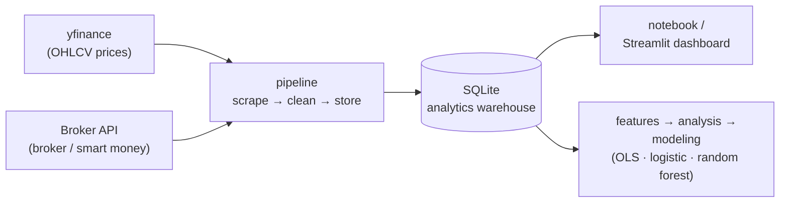

# 📈 IDX Bandarmology — Smart Money Tracker for Indonesian Stocks

An end-to-end data pipeline for testing a simple question:

> **Do large-broker accumulation signals and foreign flow actually align with stronger IDX stock returns, or are they mostly trader folklore?**

The project is built around a notebook-first workflow, with a separate Streamlit dashboard for interactive exploration and portfolio-ready screenshots.

---

## Why this project?

Broker flow and "bandar detector" data are usually locked behind paid platforms and are hard to analyze systematically. This repo:

1. Pulls real broker buy/sell, foreign/domestic flow, and accumulation/distribution signals from a private broker-data endpoint using your own token.
2. Combines them with historical OHLCV prices from yfinance.
3. Stores everything in SQLite as a lightweight analytics warehouse.
4. Builds derived features for both historical and forward returns.
5. Runs simple statistical and ML tests to see whether smart money signals are associated with returns.
6. Exposes the same dataset in a Streamlit dashboard for quick review and sharing.

## Architecture



Each module is intentionally small and reusable on its own under `src/idx_bandarmology/`.

## Repository structure

```text
idx-bandarmology/
├── .env.example
├── requirements.txt
├── notebooks/
│   └── 01_bandarmology_end_to_end.ipynb
├── dashboard/
│   └── app.py
├── src/idx_bandarmology/
│   ├── config.py
│   ├── broker_api.py
│   ├── prices.py
│   ├── storage.py
│   ├── pipeline.py
│   ├── features.py
│   ├── analysis.py
│   └── modeling.py
└── data/
    ├── raw/
    ├── processed/
    └── db/bandarmology.sqlite
```

## Setup

```bash
git clone <your-repo-url>
cd idx-bandarmology
python -m venv .venv
source .venv/bin/activate
pip install -r requirements.txt

cp .env.example .env
```

Then edit `.env` and set `BROKER_API_TOKEN`.

## About `BROKER_API_TOKEN`

The broker/bandar data comes from a private, authenticated broker-data endpoint, so you need to supply your own session token from an account that already has access. Capture the bearer token your own logged-in session sends to that endpoint, then paste it into `.env`:

```bash
BROKER_API_TOKEN=your_token_here
```

Treat this token like a password: keep it private and never commit `.env` (it is already in `.gitignore`). Without the token, price data still loads, but broker and bandar data are skipped.

## Main workflow: notebook

```bash
jupyter notebook notebooks/01_bandarmology_end_to_end.ipynb
```

Run the notebook from top to bottom. It covers:

1. Pipeline execution with yfinance and the broker-flow endpoint.
2. Raw table inspection from SQLite.
3. Feature engineering.
4. Descriptive analysis and correlation checks.
5. OLS regression and simple classification models.
6. A plain-English verdict summary.

Edit the watchlist in the notebook to track different stocks:

```python
WATCHLIST = ["BBCA", "BBRI", "BMRI", "BBNI", "TLKM", "ASII", "UNVR", "GOTO", "BREN", "ANTM"]
```

Important: the broker-flow endpoint provides a latest snapshot, not a historical archive. To build a usable time series, run the pipeline on multiple trading days.

## Dashboard

```bash
streamlit run dashboard/app.py
```

The dashboard reads the same SQLite file as the notebook, so both views stay in sync.

Dashboard sections:

- **Overview**: latest price snapshot and daily signal markers.
- **Broker Flow**: latest broker-flow and signal summaries by ticker.
- **Correlation Analysis**: correlation table, return distribution, and scatter plots.
- **Modeling / Hypothesis**: OLS and classification outputs with a short interpretation.

The dashboard now defaults to **historical returns**. If you switch to **forward returns**, the newest broker snapshot may still show blanks because future price rows do not exist yet.

## Results

A worked example on **BULL** (PT Buana Lintas Lautan), backfilled over **2026-03-31 → 2026-06-19** (243 price rows, 105 broker-flow rows, 3,353 broker-activity rows).

### Headline: the aggregate signal can mislead

BULL rose **+17.18% over 5 days** and **+15.06% over 10 days** — while its *latest aggregate* "bandar" signal read **Strong Distribution** (i.e. bearish). The headline label was pointing the wrong way. The useful information was one level down, in **individual broker behaviour**.


### Not all brokers are equal — volume ≠ skill

Ranking every broker by *how its repeated net-buying of BULL was followed by forward returns* (≥5 events, positive mean, one-sided p < 0.05 to flag as significant) separates real edge from noise. The highest-**volume** brokers turned out to be the least predictive:

| Broker | Net-buy events | Win rate | Mean 10-day fwd return | p-value | Significant? |
|--------|:---:|:---:|:---:|:---:|:---:|
| **GA** | 11 | **73%** | **+15.48%** | **0.0053** | ✅ yes |
| II | 38 | 50% | +3.77% | 0.0642 | ❌ no |
| ZP | 37 | 46% | — | 0.1171 | ❌ no |
| SQ | 35 | 49% | — | 0.0822 | ❌ no |

> Lower-volume broker **GA** carried a genuine, statistically significant edge (p = 0.0053 ≈ 99.5% confidence), while the three biggest-volume brokers on the stock (II, ZP, SQ) had roughly coin-flip win rates. Across the whole watchlist, **17 broker–ticker combinations** passed the significance filter.


### Who keeps buying BULL? Connecting the flow to the "bandar"

Look past win rate for a second and just ask *who shows up over and over*. Broker code **II** net-bought BULL on **38 separate trading days** in this window — by far the most **persistent** accumulator on the stock. It is the steadily climbing red (II) line in the broker-flow chart below: it keeps adding even while price chops sideways and other brokers flip in and out. That relentless, price-insensitive buying is the classic fingerprint of a **"bandar"** — a large, patient operator quietly building a position rather than chasing momentum.

So who is behind that code? Public broker-code references map **II** to **PT Danatama Makmur Sekuritas**. Based on publicly reported board compositions and shareholder disclosures, this brokerage and the issuer (BULL) share a **reported corporate affiliation** — overlapping membership of the same controlling family at board level, and Danatama-linked entities listed on BULL's public shareholder register. (Reported public-record relationships; confirm current details against the latest exchange filings.)

> **The hypothesis this surfaces:** the most persistent "bandar" accumulating BULL is routing through a broker **affiliated with BULL's own controlling owners** — i.e. the patient smart money on this stock may be connected to the insiders themselves. That is a striking, *testable* lead that the pipeline produced automatically from raw broker codes.

> ⚠️ **Observational hypothesis, not an allegation.** A broker code identifies the *executing member firm*, not the end client, so it cannot prove who actually traded — many unrelated clients can route orders through the same broker. There is **no public evidence** that any specific director or insider placed these trades. The value here is methodological: broker-flow data turned an anonymous code into a named, affiliated counterparty worth investigating with proper disclosures.


### Event study: what happens after an accumulation signal?

Normalized price paths (signal date = 100) for each accumulation event out to +10 days, with the **average path** in black. The average drifts **above 100 through the +5-day horizon**, consistent with a short-lived post-accumulation bump rather than a durable trend.


### Broker distribution snapshot

Net buy (green) vs. net sell (red) by broker on a single day — the cross-section of who is on each side of the tape behind every daily signal.


> Scope & reproducibility: these are a snapshot from the BULL analysis (2026-03-31 → 2026-06-19) produced by `notebooks/01_bandarmology_end_to_end.ipynb` and `dashboard/app.py` against the same SQLite warehouse. A short history, a small watchlist, and multiple-testing risk make these findings **exploratory, not production trading signals** — re-running on a longer history will shift the exact numbers. See the Disclaimer at the bottom.

## Methodology

- **Historical returns**: `back_return_5d` measures how much the stock moved over the last 5 trading days up to the signal date.
- **Forward returns**: `fwd_return_5d` measures how much the stock moves over the next 5 trading days after the signal date.
- **Smart money features**: bandar detector score, foreign broker net, foreign flow, and volume-based context.
- **OLS regression**: checks whether signal variables have statistically significant relationships with returns.
- **Classification models**: turn returns into a binary up/down target and report accuracy, precision, recall, and ROC-AUC.

With a short history and a small watchlist, results are exploratory rather than production-grade trading signals.

## Roadmap

- [ ] Add automatic scheduling for daily pipeline runs.
- [ ] Add broader market universes such as IDX30 or LQ45.
- [ ] Add a walk-forward backtest for simple signal rules.
- [ ] Add a more production-oriented BI layer if needed.

## Disclaimer

This project is for education and personal research. It is not investment advice. Access to the private broker-flow endpoint requires your own account token and should be used in line with the provider's terms of service.

The corporate-affiliation note in **Results** ("governance breadcrumb") is based on publicly reported information about board composition and shareholder registers, and is presented strictly as an observational research hypothesis. Broker codes identify the executing member firm, not the underlying client; nothing here asserts, or should be read to imply, that any named company or individual engaged in insider trading or any other wrongdoing.
