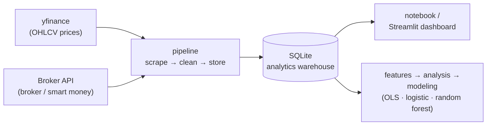

# 📈 IDX Bandarmology — Smart Money Tracker for Indonesian Stocks

An end-to-end data pipeline for testing a simple question:

> **Do large-broker accumulation signals and foreign flow actually align with stronger IDX stock returns, or are they mostly trader folklore?**

The project is built around a notebook-first workflow, with a separate Streamlit dashboard for interactive exploration and portfolio-ready screenshots.

---

## Why this project?

Broker flow and "bandar detector" data are usually locked behind paid platforms and are hard to analyze systematically. This repo:

1. Pulls real broker buy/sell, foreign/domestic flow, and accumulation/distribution signals from a private broker-data endpoint using your own token.
2. Combines them with historical OHLCV prices from yfinance.
3. Stores everything in SQLite as a lightweight analytics warehouse.
4. Builds derived features for both historical and forward returns.
5. Runs simple statistical and ML tests to see whether smart money signals are associated with returns.
6. Exposes the same dataset in a Streamlit dashboard for quick review and sharing.

## Architecture



Each module is intentionally small and reusable on its own under `src/idx_bandarmology/`.

## Repository structure

```text
idx-bandarmology/
├── .env.example
├── requirements.txt
├── notebooks/
│   └── 01_bandarmology_end_to_end.ipynb
├── dashboard/
│   └── app.py
├── src/idx_bandarmology/
│   ├── config.py
│   ├── broker_api.py
│   ├── prices.py
│   ├── storage.py
│   ├── pipeline.py
│   ├── features.py
│   ├── analysis.py
│   └── modeling.py
└── data/
    ├── raw/
    ├── processed/
    └── db/bandarmology.sqlite
```

## Setup

```bash
git clone <your-repo-url>
cd idx-bandarmology
python -m venv .venv
source .venv/bin/activate
pip install -r requirements.txt

cp .env.example .env
```

Then edit `.env` and set `BROKER_API_TOKEN`.

## About `BROKER_API_TOKEN`

The broker/bandar data comes from a private, authenticated broker-data endpoint, so you need to supply your own session token from an account that already has access. Capture the bearer token your own logged-in session sends to that endpoint, then paste it into `.env`:

```bash
BROKER_API_TOKEN=your_token_here
```

Treat this token like a password: keep it private and never commit `.env` (it is already in `.gitignore`). Without the token, price data still loads, but broker and bandar data are skipped.

## Main workflow: notebook

```bash
jupyter notebook notebooks/01_bandarmology_end_to_end.ipynb
```

Run the notebook from top to bottom. It covers:

1. Pipeline execution with yfinance and the broker-flow endpoint.
2. Raw table inspection from SQLite.
3. Feature engineering.
4. Descriptive analysis and correlation checks.
5. OLS regression and simple classification models.
6. A plain-English verdict summary.

Edit the watchlist in the notebook to track different stocks:

```python
WATCHLIST = ["BBCA", "BBRI", "BMRI", "BBNI", "TLKM", "ASII", "UNVR", "GOTO", "BREN", "ANTM"]
```

Important: the broker-flow endpoint provides a latest snapshot, not a historical archive. To build a usable time series, run the pipeline on multiple trading days.

## Dashboard

```bash
streamlit run dashboard/app.py
```

The dashboard reads the same SQLite file as the notebook, so both views stay in sync.

Dashboard sections:

- **Overview**: latest price snapshot and daily signal markers.
- **Broker Flow**: latest broker-flow and signal summaries by ticker.
- **Correlation Analysis**: correlation table, return distribution, and scatter plots.
- **Modeling / Hypothesis**: OLS and classification outputs with a short interpretation.

The dashboard now defaults to **historical returns**. If you switch to **forward returns**, the newest broker snapshot may still show blanks because future price rows do not exist yet.

## Results

A worked example on **BULL** (PT Buana Lintas Lautan) over ~Apr–Jun 2026.

**Headline finding:** the *aggregate* "bandar" label is noisy and tracks price more than it leads it — but **individual broker behaviour shows an initial, testable edge**. Ranking cases where a single broker repeatedly net-bought a ticker and then measuring forward returns surfaces a statistically significant result:

> Broker **EL** net-buying **BULL**: **14 events**, mean **10-day forward return +15.0%**, **win rate 71%**, one-sided **p-value 0.0348** (significant at the 5% level: ≥5 events, positive mean, p < 0.05).

Over the same window the stock itself fell (5D −7.7%, 10D −6.8%) while its latest *aggregate* signal read **Strong Distribution** — a good illustration of why the broker-level view beats the headline label.

### Price with smart-money signal overlays
Daily close with accumulation/distribution markers underneath — distribution clusters dominate the down-leg.


### Broker flow by daily net accumulation
Cumulative net value per broker (vs. close price, dashed). Brokers visibly diverge — some accumulate while others distribute into the same move.


### Event study after signal dates
Normalized price paths (signal date = 100) for accumulation events out to +10 days, with the average path in black.


### Broker distribution snapshot
Net buy (green) vs. net sell (red) by broker on a single day — the cross-section behind each daily signal.


> Scope note: a short history and a small watchlist make these findings exploratory, not production trading signals — see Methodology below.
>
> Reproducibility: figures above are a snapshot from the BULL analysis (~Apr–Jun 2026 broker history) produced by `notebooks/01_bandarmology_end_to_end.ipynb` and `dashboard/app.py` against the same SQLite warehouse. Re-running the pipeline on a longer history will shift the exact numbers.

## Methodology

- **Historical returns**: `back_return_5d` measures how much the stock moved over the last 5 trading days up to the signal date.
- **Forward returns**: `fwd_return_5d` measures how much the stock moves over the next 5 trading days after the signal date.
- **Smart money features**: bandar detector score, foreign broker net, foreign flow, and volume-based context.
- **OLS regression**: checks whether signal variables have statistically significant relationships with returns.
- **Classification models**: turn returns into a binary up/down target and report accuracy, precision, recall, and ROC-AUC.

With a short history and a small watchlist, results are exploratory rather than production-grade trading signals.

## Roadmap

- [ ] Add automatic scheduling for daily pipeline runs.
- [ ] Add broader market universes such as IDX30 or LQ45.
- [ ] Add a walk-forward backtest for simple signal rules.
- [ ] Add a more production-oriented BI layer if needed.

## Disclaimer

This project is for education and personal research. It is not investment advice. Access to the private broker-flow endpoint requires your own account token and should be used in line with the provider's terms of service.
