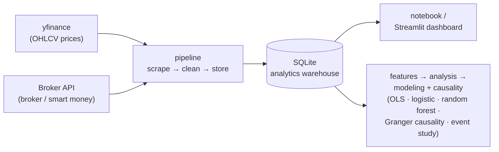
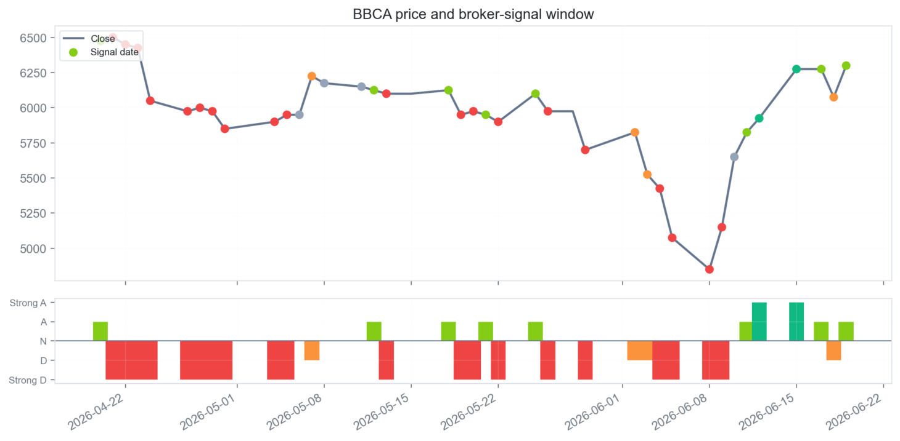
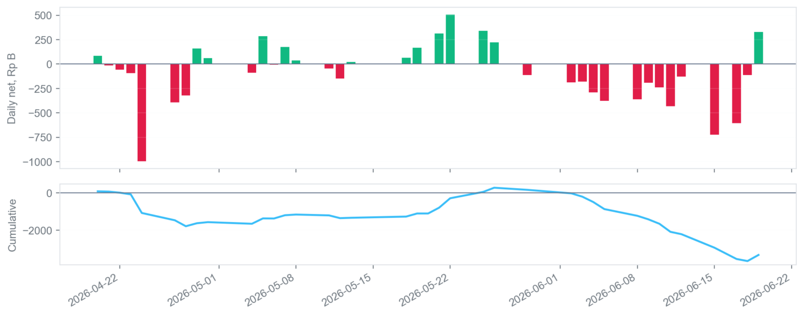
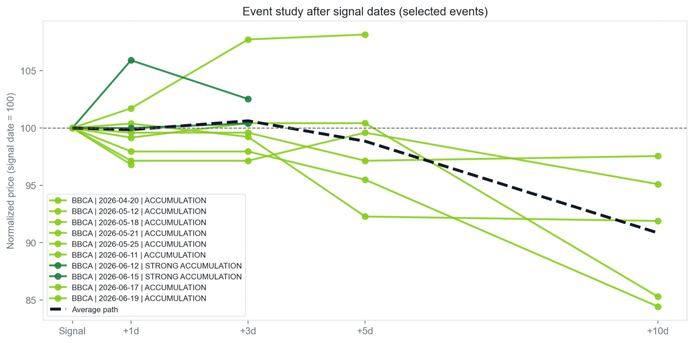
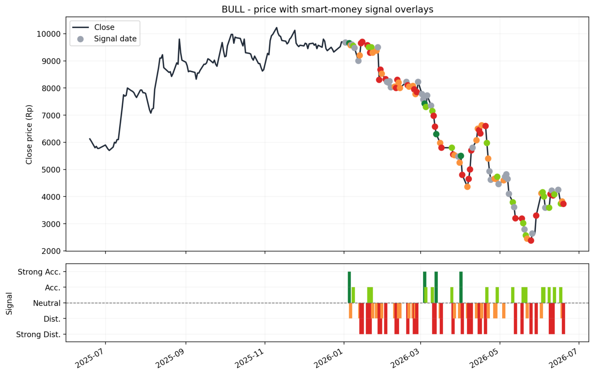
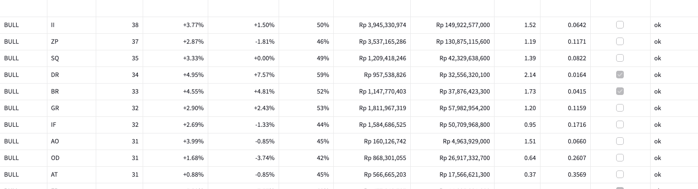
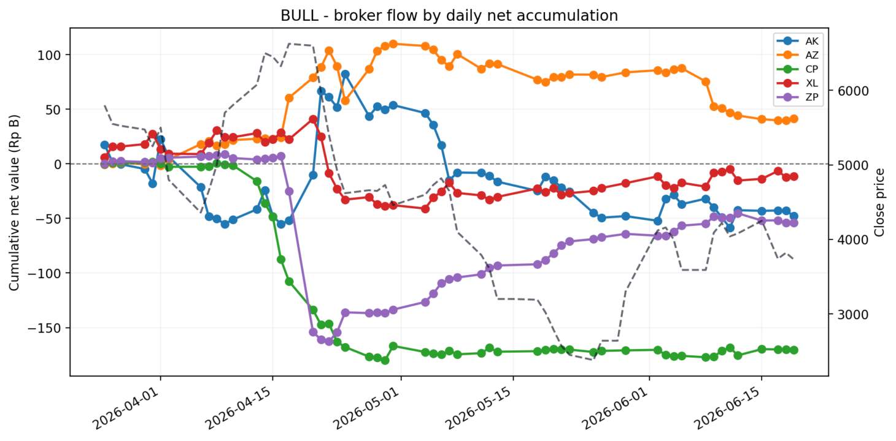
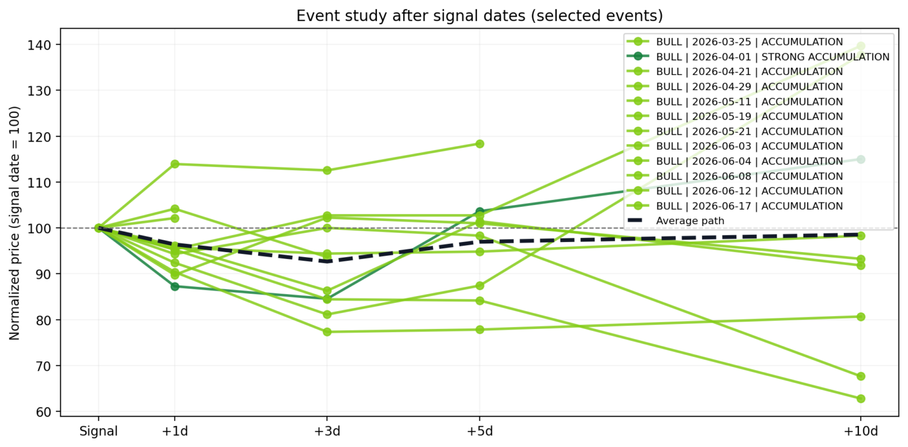
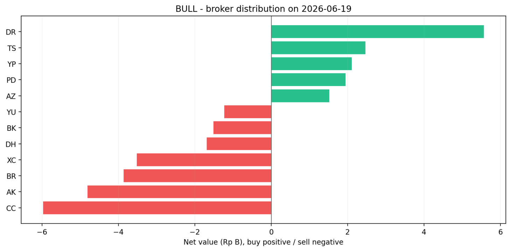

# 📈 IDX Bandarmology — Smart Money Tracker for Indonesian Stocks

An end-to-end data pipeline for testing a simple question:

> **Do large-broker accumulation signals and foreign flow actually align with stronger IDX stock returns, or are they mostly trader folklore?**

The project is built around a notebook-first workflow, with a separate Streamlit dashboard for interactive exploration and portfolio-ready screenshots.

---

## What this project demonstrates

A single, end-to-end project that exercises the **full data lifecycle** — built to show practical **Data Engineering**, **Data Analysis**, and **Data Science** skills in one place.

| Role | What I built here |
|------|-------------------|
| 🛠️ **Data Engineer** | End-to-end **ETL pipeline** ingesting two live sources (yfinance OHLCV + an authenticated broker-flow API), cleaning and landing them into a **SQLite analytics warehouse**; **incremental multi-day backfill** that turns broker *snapshots* into a time series; a modular, reusable Python package (`config` · `broker_api` · `prices` · `storage` · `pipeline` · `features`) with secrets handled via `.env`. |
| 📊 **Data Analyst** | A **5-tab interactive Streamlit dashboard** with KPI cards, filters and drill-downs; **visual storytelling** (price/signal overlays, broker flow, distribution, event studies); business framing that turns anonymous broker codes into *"who is actually accumulating"*; plus a portfolio-ready [static HTML preview](docs/dashboard-preview.html). |
| 🔬 **Data Scientist** | **Feature engineering** (forward/backward returns, smart-money features); **statistical inference** (OLS with HAC/Newey–West robust errors, one-sided significance tests with multiple-testing awareness); **Granger causality** for lead/lag (statsmodels); **classification models** (logistic regression & random forest) scored with precision, recall & ROC-AUC; and an **event-study** framework. |

**Tech stack:** Python · pandas · NumPy · statsmodels · scikit-learn · SQLite · Streamlit · matplotlib · yfinance · Jupyter

## Why this project?

Broker flow and "bandar detector" data are usually locked behind paid platforms and are hard to analyze systematically. This repo:

1. Pulls real broker buy/sell, foreign/domestic flow, and accumulation/distribution signals from a private broker-data endpoint using your own token.
2. Combines them with historical OHLCV prices from yfinance.
3. Stores everything in SQLite as a lightweight analytics warehouse.
4. Builds derived features for both historical and forward returns.
5. Runs simple statistical and ML tests to see whether smart money signals are associated with returns.
6. Exposes the same dataset in a Streamlit dashboard for quick review and sharing.

## Architecture



Each module is intentionally small and reusable on its own under `src/idx_bandarmology/`.

## Repository structure

```text
idx-bandarmology/
├── .env.example
├── requirements.txt
├── notebooks/
│   └── 01_bandarmology_end_to_end.ipynb
├── dashboard/
│   └── app.py
├── src/idx_bandarmology/
│   ├── config.py
│   ├── broker_api.py
│   ├── prices.py
│   ├── storage.py
│   ├── pipeline.py
│   ├── features.py
│   ├── analysis.py
│   └── modeling.py
└── data/
    ├── raw/
    ├── processed/
    └── db/bandarmology.sqlite
```

## Setup

```bash
git clone <your-repo-url>
cd idx-bandarmology
python -m venv .venv
source .venv/bin/activate
pip install -r requirements.txt

cp .env.example .env
```

Then edit `.env` and set `BROKER_API_TOKEN`.

## About `BROKER_API_TOKEN`

The broker/bandar data comes from a private, authenticated broker-data endpoint, so you need to supply your own session token from an account that already has access. Capture the bearer token your own logged-in session sends to that endpoint, then paste it into `.env`:

```bash
BROKER_API_TOKEN=your_token_here
```

Treat this token like a password: keep it private and never commit `.env` (it is already in `.gitignore`). Without the token, price data still loads, but broker and bandar data are skipped.

## Main workflow: notebook

```bash
jupyter notebook notebooks/01_bandarmology_end_to_end.ipynb
```

Run the notebook from top to bottom. It covers:

1. Pipeline execution with yfinance and the broker-flow endpoint.
2. Raw table inspection from SQLite.
3. Feature engineering.
4. Descriptive analysis and correlation checks.
5. OLS regression and simple classification models.
6. A plain-English verdict summary.

Edit the watchlist in the notebook to track different stocks:

```python
WATCHLIST = ["BBCA", "BBRI", "BMRI", "BBNI", "TLKM", "ASII", "UNVR", "GOTO", "BREN", "ANTM"]
```

Important: the broker-flow endpoint provides a latest snapshot, not a historical archive. To build a usable time series, run the pipeline on multiple trading days.

## Dashboard

```bash
streamlit run dashboard/app.py
```

The dashboard reads the same SQLite warehouse as the notebook, so both views stay in sync. From the sidebar you choose a **universe**, a **focused ticker**, an **analysis date**, a **lookback window**, and the **validation horizon** / **minimum-event** thresholds — and can trigger a fresh pipeline run or a historical backfill in place. Headline metric cards (close, 5D / 10D return, aggregate signal, smart-money cumulative flow) sit above five tabs:

- **Overview** — price-and-signal context chart for the focused ticker, the selected date's top net buyers and sellers, and the broker profile flow.
- **Broker Flow** — smart-money cumulative daily flow, multi-timeframe price performance, and the single-day broker distribution.
- **Causality Insight** — Granger-causality tests for whether foreign flow (in aggregate, by participant type, and broker-by-broker) statistically *leads* price.
- **Validation** — the broker-specific return validation table (events, mean/median forward return, win rate, net buy, significance) plus an accumulation event-study chart.
- **Raw Tables** — the underlying window-level broker-flow and broker-activity rows.

**No Python install?** Open [`docs/dashboard-preview.html`](docs/dashboard-preview.html) for a static, self-contained gallery of the live dashboard's BBCA and BULL views.

## Broker behavioral profiles — smart money vs. retail

Raw broker codes are anonymous, so before anything else the pipeline **groups every executing broker into a behavioral profile** and then nets their flow by group. This is what powers the *"who is really accumulating?"* read — separating conviction money from the crowd:

| Profile | What it represents |
|---------|--------------------|
| 🟢 **Foreign Smart Money** | Directional foreign institutions with higher conviction |
| 🔵 **Local Institutions** | Local funds and institution-like accounts |
| 🟣 **Market Makers** | Active on both sides — the *net* position is what matters |
| 🟠 **Speculative Operators** | Higher-risk, momentum / "gorengan"-style participants |
| ⚪ **Retail-Dominant** | Retail-heavy platforms, often late or contrarian |

In the dashboard, **"Smart Money" = Foreign Smart Money + Local Institutions**. The Overview tab's **Broker profile flow** panel shows net buy/sell for each group on the selected day, and the Broker-Flow tab's **Smart-money daily flow** chart sums only those two smart-money groups.

> These are **heuristic behavioral buckets** inferred from broker-code patterns, not official classifications — they describe how a desk *tends* to trade, not the identity of any end client.

## Results

Two worked examples, produced by the **same pipeline** against the same SQLite warehouse over **2026-03-31 → 2026-06-19**: **BBCA** (Bank Central Asia — the headline case) and **BULL** (PT Buana Lintas Lautan). Analysing any other stock is just a matter of changing the focused ticker.

### Headline case study — BBCA caught the June bottom

Bank Central Asia (**BBCA**) sold off from ~Rp 6,350 in late April to a trough near **Rp 4,850 around 2026-06-08** (a ~24% drawdown), then rebounded ~**30%** to ~Rp 6,300 by **2026-06-19**. Through the whole decline the aggregate bandar signal printed **Distribution** (red); it then **flipped to Accumulation / Strong Accumulation** (green) right at the June low, just before the bounce. Here the headline signal *tracked* the move instead of fighting it.



> 📖 **In plain words:** the top line is BBCA's share price; the coloured dots underneath are the daily verdict — **red = big players selling, green = big players buying**. The dots flip to green right as the price hits bottom and starts climbing again.

The broker money flow adds a more cautious second layer. Cumulative broker net flow stayed **deeply negative** across the window — drifting to roughly **−Rp 2.8 trillion** by 2026-06-19 even as price recovered — punctuated by only brief green accumulation bursts (e.g. around 2026-05-22). On the final signal day, **foreign desks net bought (+Rp 43.62 B)** while **local desks net sold (−Rp 176.58 B)**: foreign money quietly accumulating into domestic selling.



> 📖 **In plain words:** the bars show how much brokers bought (green) or sold (red) each day; the line is the running total. Even though the price recovered, the line keeps sliding down — so across the whole period brokers were net **sellers**, not buyers.

The event study keeps the finding honest. Individual accumulation events — especially the **Strong Accumulation** prints on 2026-06-12 and 2026-06-15 — popped **+5–8% within 1–3 days**. But the **average path** (dashed) only hovers near the signal level through +3 days before **fading to roughly −9% by +10 days**: the short-term bump is real, a durable 10-day edge is not. A signal to act on quickly, not to hold blindly.



> 📖 **In plain words:** every "buy" signal is lined up at the same starting point (day 0 = 100) to see what the price did next. Prices often jumped in the first few days, but **on average drifted back down by day 10** — a quick bounce, not a lasting climb.

### Second case — switch the ticker to BULL: when the aggregate signal misleads

Point the same pipeline at **BULL** (243 price rows, 105 broker-flow rows, 3,353 broker-activity rows in this window) and it tells the *opposite* kind of story — one where the aggregate label fights the move and the real edge hides one level down, in individual broker behaviour.

BULL rose **+17.18% over 5 days** and **+15.06% over 10 days** — while its *latest aggregate* "bandar" signal read **Strong Distribution** (i.e. bearish). The headline label was pointing the wrong way. The useful information was one level down, in **individual broker behaviour**.



> 📖 **In plain words:** BULL's price with the same buy/sell signal dots. Here the single headline verdict said "selling" **even while the price kept rising** — proof that the one-line summary can point the wrong way, and you have to look deeper.

### Not all brokers are equal — volume ≠ skill

Ranking every broker by *how its repeated net-buying of BULL was followed by forward returns* (≥5 events, positive mean, one-sided p < 0.05 to flag as significant) separates real edge from noise. The highest-**volume** brokers turned out to be the least predictive:

| Broker | Net-buy events | Win rate | Mean 10-day fwd return | p-value | Significant? |
|--------|:---:|:---:|:---:|:---:|:---:|
| **GA** | 11 | **73%** | **+15.48%** | **0.0053** | ✅ yes |
| II | 38 | 50% | +3.77% | 0.0642 | ❌ no |
| ZP | 37 | 46% | — | 0.1171 | ❌ no |
| SQ | 35 | 49% | — | 0.0822 | ❌ no |

> Lower-volume broker **GA** carried a genuine, statistically significant edge (p = 0.0053 ≈ 99.5% confidence), while the three biggest-volume brokers on the stock (II, ZP, SQ) had roughly coin-flip win rates. Across the whole watchlist, **17 broker–ticker combinations** passed the significance filter.



> 📖 **In plain words:** a scoreboard that ranks each broker by whether their buying was *actually* followed by price gains. It automatically separates brokers with a real track record from the ones that are just noise.

### Who keeps buying BULL? Connecting the flow to the "bandar"

Look past win rate for a second and just ask *who shows up over and over*. Broker code **II** net-bought BULL on **38 separate trading days** in this window — by far the most **persistent** accumulator on the stock. It is the steadily climbing red (II) line in the broker-flow chart below: it keeps adding even while price chops sideways and other brokers flip in and out. That relentless, price-insensitive buying is the classic fingerprint of a **"bandar"** — a large, patient operator quietly building a position rather than chasing momentum.

So who is behind that code? Public broker-code references map **II** to **PT Danatama Makmur Sekuritas**. Based on publicly reported board compositions and shareholder disclosures, this brokerage and the issuer (BULL) share a **reported corporate affiliation** — overlapping membership of the same controlling family at board level, and Danatama-linked entities listed on BULL's public shareholder register. (Reported public-record relationships; confirm current details against the latest exchange filings.)

> **The hypothesis this surfaces:** the most persistent "bandar" accumulating BULL is routing through a broker **affiliated with BULL's own controlling owners** — i.e. the patient smart money on this stock may be connected to the insiders themselves. That is a striking, *testable* lead that the pipeline produced automatically from raw broker codes.

> ⚠️ **Observational hypothesis, not an allegation.** A broker code identifies the *executing member firm*, not the end client, so it cannot prove who actually traded — many unrelated clients can route orders through the same broker. There is **no public evidence** that any specific director or insider placed these trades. The value here is methodological: broker-flow data turned an anonymous code into a named, affiliated counterparty worth investigating with proper disclosures.



> 📖 **In plain words:** each line is one broker's running total of buying. A line that keeps climbing steadily is a player quietly building a big position day after day — the classic fingerprint of a **"bandar"** (a large operator).

### Event study: what happens after an accumulation signal?

Normalized price paths (signal date = 100) for each accumulation event out to +10 days, with the **average path** in black. The average drifts **above 100 through the +5-day horizon**, consistent with a short-lived post-accumulation bump rather than a durable trend.



> 📖 **In plain words:** same idea as the BBCA version — all buy signals lined up at day 0 to see the average price path afterwards. For BULL the average line stays **above** the start, so a short-term gain tended to follow.

### Broker distribution snapshot

Net buy (green) vs. net sell (red) by broker on a single day — the cross-section of who is on each side of the tape behind every daily signal.



> 📖 **In plain words:** a single day's snapshot of who bought (green) versus who sold (red), broker by broker — the cast of characters behind that day's signal.

> Scope & reproducibility: these are a snapshot from the BULL analysis (2026-03-31 → 2026-06-19) produced by `notebooks/01_bandarmology_end_to_end.ipynb` and `dashboard/app.py` against the same SQLite warehouse. A short history, a small watchlist, and multiple-testing risk make these findings **exploratory, not production trading signals** — re-running on a longer history will shift the exact numbers. See the Disclaimer at the bottom.

### Upgraded dashboard: causality & broker-level validation

The latest build grows the warehouse from a single stock toward the **full watchlist** and adds two analytical layers on top of the event study above, surfaced in the dashboard's **Causality Insight** and **Validation** tabs:

- **Granger causality** (`statsmodels`): for the focused ticker it tests whether foreign net flow — in aggregate, by participant type, and broker-by-broker — *precedes and predicts* price over the next few days, rather than merely moving with it on the same day (p < 0.05 flags a significant lead).
- **Broker-specific return validation** (`broker_alpha_scan`): for every broker that repeatedly net-bought the ticker it reports event count, mean/median forward return, win rate, and a one-sided significance test, applying the same "≥5 events, positive mean, p < 0.05" bar used in the BULL study above — now driven by a configurable horizon and minimum-event threshold.

Both layers run **per focused ticker** — the BBCA headline case and the BULL case above are produced by changing the **Ticker** selector and nothing else.

## Methodology

- **Historical returns**: `back_return_5d` measures how much the stock moved over the last 5 trading days up to the signal date.
- **Forward returns**: `fwd_return_5d` measures how much the stock moves over the next 5 trading days after the signal date.
- **Smart money features**: bandar detector score, foreign broker net, foreign flow, and volume-based context.
- **OLS regression**: checks whether signal variables have statistically significant relationships with returns.
- **Classification models**: turn returns into a binary up/down target and report accuracy, precision, recall, and ROC-AUC.
- **Granger causality**: tests whether lagged foreign flow improves the prediction of price beyond price's own history — a directional ("leads") check rather than a same-day correlation.
- **Broker-specific validation**: ranks individual brokers by the statistical significance of the forward returns that follow their repeated net buying, flagging only accumulators that clear the one-sided test.

With a short history and a small watchlist, results are exploratory rather than production-grade trading signals.

## Roadmap

- [ ] Add automatic scheduling for daily pipeline runs.
- [ ] Add broader market universes such as IDX30 or LQ45.
- [ ] Add a walk-forward backtest for simple signal rules.
- [ ] Add a more production-oriented BI layer if needed.

## Disclaimer

This project is for education and personal research. It is not investment advice. Access to the private broker-flow endpoint requires your own account token and should be used in line with the provider's terms of service.

The corporate-affiliation note in **Results** ("governance breadcrumb") is based on publicly reported information about board composition and shareholder registers, and is presented strictly as an observational research hypothesis. Broker codes identify the executing member firm, not the underlying client; nothing here asserts, or should be read to imply, that any named company or individual engaged in insider trading or any other wrongdoing.
