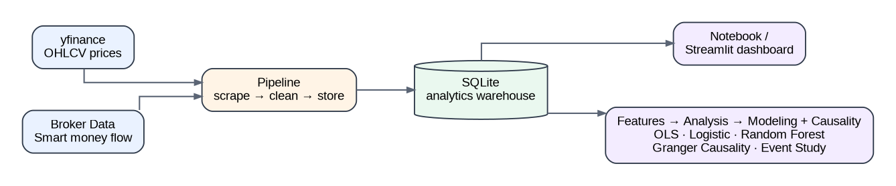
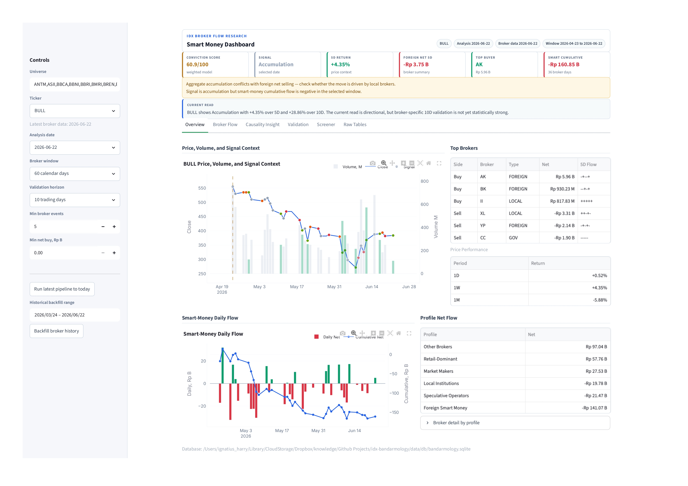
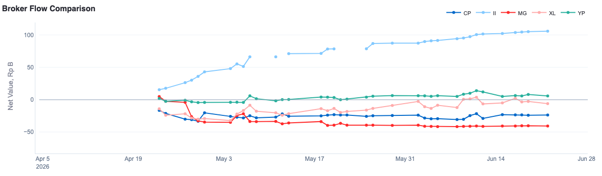
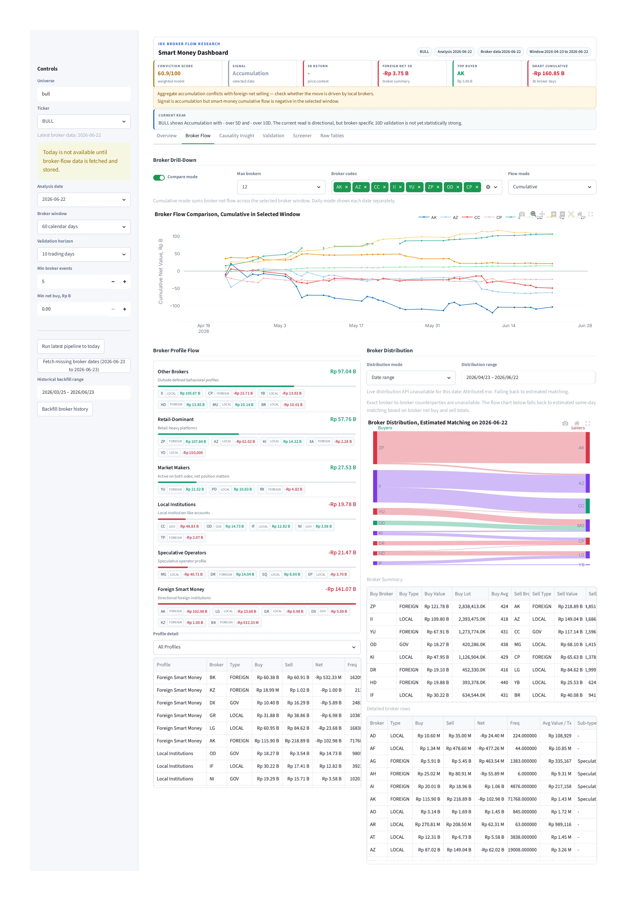

# 📈 IDX Bandarmology — Smart Money Tracker for Indonesian Stocks

An end-to-end data pipeline for testing a simple question:

> **Do large-broker accumulation signals and foreign flow actually align with stronger IDX stock returns, or are they mostly trader folklore?**

The project is built around a notebook-first workflow, with a separate Streamlit dashboard for interactive exploration and portfolio-ready screenshots.

---

## What this project demonstrates

A single, end-to-end project that exercises the **full data lifecycle** — built to show practical **Data Engineering**, **Data Analysis**, and **Data Science** skills in one place.

| Role | What I built here |
|------|-------------------|
| 🛠️ **Data Engineer** | End-to-end **ETL pipeline** ingesting two live sources (yfinance OHLCV + an authenticated broker-flow API), cleaning and landing them into a **SQLite analytics warehouse**; **incremental multi-day backfill** that turns broker *snapshots* into a time series; a modular, reusable Python package (`config` · `broker_api` · `prices` · `storage` · `pipeline` · `features`) with secrets handled via `.env`. |
| 📊 **Data Analyst** | A **6-tab interactive Streamlit dashboard** with KPI cards, filters and drill-downs; **visual storytelling** (price/signal context, broker-flow comparison, profile grouping, broker-to-broker distribution, event studies); business framing that turns anonymous broker codes into *"who is actually accumulating"*. |
| 🔬 **Data Scientist** | **Feature engineering** (forward/backward returns, smart-money features); **statistical inference** (OLS with HAC/Newey–West robust errors, one-sided significance tests with multiple-testing awareness); **Granger causality** for lead/lag (statsmodels); **classification models** (logistic regression & random forest) scored with precision, recall & ROC-AUC; and an **event-study** framework. |

**Tech stack:** Python · pandas · NumPy · statsmodels · scikit-learn · SQLite · Streamlit · matplotlib · yfinance · Jupyter

## The story behind this project

It started with a question every Indonesian retail investor eventually asks: **does "smart money" really exist on the IDX, or is *bandarmology* just folklore?**

I went looking with **BULL** (PT Buana Lintas Lautan), a company transforming into **LNG shipping**. After taking delivery of its first LNG carrier — **MT Gas Garuda (145,914 CBM)** in December 2025 — BULL planned three more LNG vessels in H2 2026 (~US$125M capex) into a market projected to need **140–155 new LNG carriers by 2027**, with analysts expecting its net profit to roughly *triple* in 2026 and brokerages such as NH Korindo initiating a **BUY (target price 800)**.

Fundamentally the story looked strong. Yet in early June the Indonesian market sold off hard and **BULL fell ~57%, from around 610 to 258** — which looked less like broken fundamentals and more like global sentiment and weak market conditions dragging the valuation down. So I asked:

> **If the business story is still strong, would any broker quietly accumulate it at a cheaper price — and if so, who?**

To answer that I built a pipeline to track flow broker-by-broker. One code kept showing up: **Broker II**, with **more than Rp 105 B cumulative net buy** over the window — a line that just kept climbing while retail-heavy brokers like **XL** sold or chopped around. That relentless, price-insensitive buying is the classic fingerprint of a **"bandar."**

Broker code **II** maps to **PT Danatama Makmur Sekuritas** — and Danatama is not just any broker on this stock. It shares the **same address** as BULL (*Danatama Square II*); **Halim Jusuf** is President Commissioner of *both* Danatama and BULL; his son **Henry Jusuf** is BULL's President Director and a former Danatama director; and Danatama-linked entities collectively hold **~5.6% of BULL's shares**. (A broker code only shows the *executing* broker, not the final client — this is a data-driven research lead, **not** an accusation.)

That curiosity became this end-to-end project, following one loop:

> **raw data → SQLite warehouse → Streamlit dashboard → feature engineering → modeling → testable hypothesis**

And the first real lesson it taught me: **the biggest broker is not always the most predictive one.** On BULL, II was the most *persistent* accumulator — but statistically a smaller broker (**GA**) carried the stronger forward-return signal. The same pipeline also surfaced signals in other stocks, including **BREN**. Both cases are below.

> Not financial advice and not a buy/sell recommendation — a data project and research case study.

## Architecture



Each module is intentionally small and reusable on its own under `src/idx_bandarmology/`.

## Repository structure

```text
idx-bandarmology/
├── .env.example
├── requirements.txt
├── notebooks/
│   └── 01_bandarmology_end_to_end.ipynb
├── dashboard/
│   └── app.py
├── src/idx_bandarmology/
│   ├── config.py
│   ├── broker_api.py
│   ├── prices.py
│   ├── storage.py
│   ├── pipeline.py
│   ├── features.py
│   ├── analysis.py
│   └── modeling.py
└── data/
    ├── raw/
    ├── processed/
    └── db/bandarmology.sqlite
```

## Setup

```bash
git clone <your-repo-url>
cd idx-bandarmology
python -m venv .venv
source .venv/bin/activate
pip install -r requirements.txt

cp .env.example .env
```

Then edit `.env` and set `BROKER_API_TOKEN`.

## About `BROKER_API_TOKEN`

The broker/bandar data comes from a private, authenticated broker-data endpoint, so you need to supply your own session token from an account that already has access. Capture the bearer token your own logged-in session sends to that endpoint, then paste it into `.env`:

```bash
BROKER_API_TOKEN=your_token_here
```

Treat this token like a password: keep it private and never commit `.env` (it is already in `.gitignore`). Without the token, price data still loads, but broker and bandar data are skipped.

## Main workflow: notebook

```bash
jupyter notebook notebooks/01_bandarmology_end_to_end.ipynb
```

Run the notebook from top to bottom. It covers:

1. Pipeline execution with yfinance and the broker-flow endpoint.
2. Raw table inspection from SQLite.
3. Feature engineering.
4. Descriptive analysis and correlation checks.
5. OLS regression and simple classification models.
6. A plain-English verdict summary.

Edit the watchlist in the notebook to track different stocks:

```python
WATCHLIST = ["BBCA", "BBRI", "BMRI", "BBNI", "TLKM", "ASII", "UNVR", "GOTO", "BREN", "ANTM"]
```

Important: the broker-flow endpoint provides a latest snapshot, not a historical archive. To build a usable time series, run the pipeline on multiple trading days.

## Dashboard

```bash
streamlit run dashboard/app.py
```

The dashboard reads the same SQLite warehouse as the notebook, so both views stay in sync. From the sidebar you choose a **universe**, a **focused ticker**, an **analysis date**, a **lookback window**, and the **validation horizon** / **minimum-event** thresholds — and can trigger a fresh pipeline run or a historical backfill in place. Headline metric cards (conviction score, signal, 5D return, foreign net flow, top buyer, smart-money cumulative flow) sit above six tabs:

- **Overview** — price / volume / signal context for the focused ticker, the day's top net buyers and sellers, multi-timeframe price performance, the smart-money daily flow, and the broker profile net flow.
- **Broker Flow** — a broker drill-down with a multi-broker **cumulative flow comparison**, the **broker profile flow** grouping, and an estimated **broker-to-broker distribution** (sankey).
- **Causality Insight** — Granger-causality tests for whether foreign flow (in aggregate, by participant type, and broker-by-broker) statistically *leads* price.
- **Validation** — the broker-specific return validation table (events, mean/median forward return, win rate, net buy, significance) plus an accumulation event-study chart.
- **Screener** — a cross-watchlist scan that ranks tickers and brokers by their validated accumulation signal, so the strongest leads surface automatically.
- **Raw Tables** — the underlying window-level broker-flow and broker-activity rows.

## Broker behavioral profiles — smart money vs. retail

Raw broker codes are anonymous, so before anything else the pipeline **groups every executing broker into a behavioral profile** and then nets their flow by group. This is what powers the *"who is really accumulating?"* read — separating conviction money from the crowd:

| Profile | What it represents |
|---------|--------------------|
| 🟢 **Foreign Smart Money** | Directional foreign institutions with higher conviction |
| 🔵 **Local Institutions** | Local funds and institution-like accounts |
| 🟣 **Market Makers** | Active on both sides — the *net* position is what matters |
| 🟠 **Speculative Operators** | Higher-risk, momentum / "gorengan"-style participants |
| ⚪ **Retail-Dominant** | Retail-heavy platforms, often late or contrarian |

In the dashboard, **"Smart Money" = Foreign Smart Money + Local Institutions**. The Overview tab's **Broker profile flow** panel shows net buy/sell for each group on the selected day, and the Broker-Flow tab's **Smart-money daily flow** chart sums only those two smart-money groups.

> These are **heuristic behavioral buckets** inferred from broker-code patterns, not official classifications — they describe how a desk *tends* to trade, not the identity of any end client.

## Results

The case studies below follow the same path as the write-up that started this project: a deep dive on **BULL** (the origin story), then a shorter look at **BREN** (the strongest *statistical* signal). Every figure is a real export from the dashboard — point it at any other ticker and the same panels regenerate.

### Main case study — BULL: "if the story is strong, who is buying the dip?"

The dashboard's **Overview** for BULL frames the puzzle in one screen. The aggregate read is **Accumulation** with a **conviction score of 60.9/100** and a positive short-term move (**+4.35% over 5D, +28.86% over 10D**), yet **foreign net flow is negative** and smart-money cumulative flow is **−Rp 160.85 B** over the window. The banner says it plainly: *accumulation conflicts with foreign net selling — check whether the move is driven by local brokers.*



So if foreign desks aren't behind it, **who is?** The **Broker Flow** tab answers by plotting each broker's *cumulative* net buying across the window. One line just keeps climbing: **Broker II**, to **> Rp 105 B** — adding relentlessly while a retail-heavy broker like **XL** drifts lower. That price-insensitive, one-directional accumulation is the classic fingerprint of a **"bandar."**



The full Broker Flow tab nets every code into behavioral profiles and reconstructs who traded against whom, so a single climbing line becomes a structured read of *which kind of money* is on each side:



#### Who is Broker II? Connecting the flow to the "bandar"

Broker code **II** maps to **PT Danatama Makmur Sekuritas**, and the public record makes this more than a coincidence:

- Danatama shares the **same address** as BULL — *Danatama Square II*.
- **Halim Jusuf** is **President Commissioner of both** Danatama Makmur Sekuritas **and** BULL.
- His son, **Henry Jusuf**, is BULL's **President Director** and a **former Danatama director**.
- Danatama-linked entities collectively hold **~5.6% of BULL's shares**.

> **The hypothesis this surfaces:** the most persistent "bandar" accumulating BULL is routing through a broker **affiliated with BULL's own controlling owners** — i.e. the patient smart money on this stock may be connected to the insiders themselves. A striking, *testable* lead that the pipeline produced automatically from raw broker codes.

> ⚠️ **Observational hypothesis, not an allegation.** A broker code identifies the *executing member firm*, not the end client, so it cannot prove who actually traded — many unrelated clients can route orders through the same broker. There is **no public evidence** that any specific director or insider placed these trades. The value here is methodological: broker-flow data turned an anonymous code into a named, affiliated counterparty worth investigating with proper disclosures.

#### Not all brokers are equal — volume ≠ skill

Persistence is not the same as predictive power. Ranking every broker by *how its repeated net-buying of BULL was followed by forward returns* (≥5 events, positive mean, one-sided p < 0.05 to flag as significant) separates real edge from noise — and the most *persistent* broker is not the most *predictive* one:

| Broker | Net-buy events | Win rate | Mean 10-day fwd return | p-value | Significant? |
|--------|:---:|:---:|:---:|:---:|:---:|
| **GA** | 11 | **73%** | **+15.48%** | **0.0053** | ✅ yes |
| II | 38 | 50% | +3.77% | 0.0642 | ❌ no |
| ZP | 37 | 46% | — | 0.1171 | ❌ no |
| SQ | 35 | 49% | — | 0.0822 | ❌ no |

> Lower-volume broker **GA** carried a genuine, statistically significant edge (p = 0.0053 ≈ 99.5% confidence), while the three biggest-volume brokers on the stock (II, ZP, SQ) had roughly coin-flip win rates. Across the whole watchlist, **17 broker–ticker combinations** passed the significance filter. BULL stays interesting to monitor — especially with a rights-issue story ahead.

### Other signals — BREN's statistically strongest broker

The same pipeline, pointed at **BREN** (Barito Renewables), produced the cleanest *statistical* result in the warehouse. Among every broker that repeatedly net-bought BREN, foreign broker **BK** stands out: **13 net-buy events, a +21.59% average 10-day forward return, a 69% win rate, and p = 0.0122** (significant at the 5% level).


The broker grouping tells the rest: over this window **Local Institutions** were the dominant net buyers (**+Rp 871 B**), with retail-heavy platforms adding **+Rp 245 B**, while **Market Makers (−Rp 417 B)** and **Foreign Smart Money (−Rp 564 B)** were net sellers — a reminder that an "Accumulation" tape can still have large foreign desks distributing underneath it.


> Scope & reproducibility: these are snapshots produced by `notebooks/01_bandarmology_end_to_end.ipynb` and `dashboard/app.py` against the same SQLite warehouse (window ending 2026-06-22). A short history, a small watchlist, and multiple-testing risk make these findings **exploratory, not production trading signals** — re-running on a longer history will shift the exact numbers. See the Disclaimer at the bottom.

### Under the hood: causality & broker-level validation

Two analytical layers sit behind the case studies above, surfaced in the dashboard's **Causality Insight** and **Validation** tabs:

- **Granger causality** (`statsmodels`): for the focused ticker it tests whether foreign net flow — in aggregate, by participant type, and broker-by-broker — *precedes and predicts* price over the next few days, rather than merely moving with it on the same day (p < 0.05 flags a significant lead).
- **Broker-specific return validation** (`broker_alpha_scan`): for every broker that repeatedly net-bought the ticker it reports event count, mean/median forward return, win rate, and a one-sided significance test, applying the same "≥5 events, positive mean, p < 0.05" bar — driven by a configurable horizon and minimum-event threshold.

Both layers run **per focused ticker** — the BULL and BREN cases above are produced by changing the **Ticker** selector and nothing else.

## Methodology

- **Historical returns**: `back_return_5d` measures how much the stock moved over the last 5 trading days up to the signal date.
- **Forward returns**: `fwd_return_5d` measures how much the stock moves over the next 5 trading days after the signal date.
- **Smart money features**: bandar detector score, foreign broker net, foreign flow, and volume-based context.
- **OLS regression**: checks whether signal variables have statistically significant relationships with returns.
- **Classification models**: turn returns into a binary up/down target and report accuracy, precision, recall, and ROC-AUC.
- **Granger causality**: tests whether lagged foreign flow improves the prediction of price beyond price's own history — a directional ("leads") check rather than a same-day correlation.
- **Broker-specific validation**: ranks individual brokers by the statistical significance of the forward returns that follow their repeated net buying, flagging only accumulators that clear the one-sided test.

With a short history and a small watchlist, results are exploratory rather than production-grade trading signals.

## Roadmap

- [ ] Add automatic scheduling for daily pipeline runs.
- [ ] Add broader market universes such as IDX30 or LQ45.
- [ ] Add a walk-forward backtest for simple signal rules.
- [ ] Add a more production-oriented BI layer if needed.

## Disclaimer

This project is for education and personal research. It is not investment advice. Access to the private broker-flow endpoint requires your own account token and should be used in line with the provider's terms of service.

The corporate-affiliation note in **Results** ("governance breadcrumb") is based on publicly reported information about board composition and shareholder registers, and is presented strictly as an observational research hypothesis. Broker codes identify the executing member firm, not the underlying client; nothing here asserts, or should be read to imply, that any named company or individual engaged in insider trading or any other wrongdoing.
