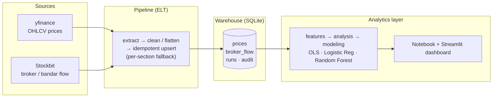

# IDX Bandarmology — Does Smart Money Predict Price?

> An end-to-end data pipeline that scrapes real broker-flow data for Indonesian
> stocks, warehouses it, and runs a statistical + machine-learning test of one
> question every retail trader argues about:

**When the "bandar" (big brokers) and foreign investors accumulate a stock today, does its price actually rise in the days that follow — or is it just trader folklore?**

This repository is a compact but complete demonstration of the full analytics
lifecycle: **data engineering → data analysis → data science**, wired together
into a reproducible pipeline with an interactive dashboard.

<p align="left">
  
  
  
  
  
  
  
</p>

---

## Why this project exists

Broker-flow and "bandar detector" data — the per-broker net buy/sell breakdown,
foreign vs. domestic flow, and accumulation/distribution signals — is normally
locked behind paid trading platforms and is hard to study systematically. Most
people *talk* about smart money; very few actually **measure** whether it works.

This project turns that argument into a falsifiable, data-driven test:

1. **Extract** real per-broker buy/sell data, foreign/domestic flow, and
   accumulation/distribution signals from Stockbit's internal API
   (`exodus.stockbit.com`), plus daily OHLCV price history from Yahoo Finance.
2. **Load** everything into a single SQLite file that acts as a mini data
   warehouse — queryable by the notebook, the dashboard, or any BI tool.
3. **Transform** raw tables into a tidy feature table whose target variable is
   the **forward return** (return *N* trading days into the future) — so we test
   prediction, not same-day mechanics.
4. **Model** the relationship two ways: an interpretable **OLS regression**
   (statistical significance) and a **classification model** (Logistic
   Regression / Random Forest) for "will price go up?" accuracy.
5. **Communicate** the result through a notebook narrative and a multi-tab
   **Streamlit dashboard**.

---

## Architecture



Every module is self-contained and independently usable — see
`src/idx_bandarmology/`.

| Module | Role | Engineering highlights |
|---|---|---|
| `config.py` | Env loading, paths, watchlist | One place to change the universe of stocks; env-overridable |
| `prices.py` | yfinance client (OHLCV) | Hides the `.JK` suffix detail; flattens yfinance MultiIndex quirks; never raises |
| `stockbit.py` | Stockbit client (broker/bandar) | Per-section graceful degradation, 5-min response cache, defensive numeric parsing |
| `storage.py` | SQLite read/write | Idempotent **upserts** (`ON CONFLICT … DO UPDATE`), run-audit table |
| `pipeline.py` | Orchestration | One call runs extract → clean → load; works token-free for prices only |
| `features.py` | Feature engineering | Builds **forward returns** as the target; volume ratios; signal encoding |
| `analysis.py` | Descriptive analytics | Correlation tables, per-ticker breakdowns, signal-bucket boxplots |
| `modeling.py` | Statistics + ML | OLS with p-values + classifier with accuracy/precision/recall/ROC-AUC |

---

## Methodology (how to read the result)

The design choices here are the point — they are what separate a real test from
a misleading one:

- **Target = forward return, not same-day return.** `fwd_return_5d` is the
  close-to-close return over the *next* 5 trading days. Same-day correlation
  would be circular: heavy buying today mechanically pushes today's price up.
  The interesting question is whether the move *continues*.
- **Features (smart-money signals):** bandar detector score (−2…+2), net foreign
  broker value, and net foreign flow **normalized by total transaction value**
  so it is comparable across stocks of very different liquidity.
- **OLS regression** reports a coefficient and p-value per signal while
  controlling for the others — *is the effect statistically distinguishable from
  zero?* A near-zero R² is normal for daily stock returns; even a small but
  significant coefficient can matter.
- **Classification** reframes it as "up or not" and reports accuracy /
  precision / recall / ROC-AUC. The honest baseline for two balanced classes is
  ~50% — every metric is read against that.
- **Honest verdict.** `modeling.hypothesis_verdict()` summarizes both models in
  plain language, and explicitly says when there is **not enough data** to draw a
  conclusion rather than overclaiming.

> Stockbit exposes a *snapshot* of the latest trading day, not history — so the
> pipeline is built to run **daily** (cron / GitHub Actions) to accumulate a
> time series. With a small watchlist and short history, early output is a
> *starting point for exploration*, not a ready-to-trade signal.

---

## Results

The interactive Streamlit dashboard turns the pipeline output into four views:

| Tab | What it answers |
|---|---|
| **Overview** | Latest price, daily change, and today's bandar signal per ticker, with a price chart marked by signal. |
| **Broker & Bandar** | Per-ticker broker summary, foreign vs. domestic flow, and a plain-language conclusion. |
| **Correlation Analysis** | Correlation table, return distribution per signal bucket, and a signal-vs-forward-return scatter. |
| **Modeling / Hypothesis** | OLS coefficients + p-values, classifier accuracy/precision/recall/ROC-AUC, and a plain-language verdict. |

<!-- Screenshots live in docs/screenshots/. Add yours and reference them here, e.g.:


-->

> **Reading the verdict:** the model output is reported against an honest ~50%
> random baseline and explicitly states when there is not yet enough data to
> draw a conclusion — measurement first, storytelling second.

---

## Quickstart

```bash
git clone https://github.com/IgnatiusHarry/idx-bandarmology.git
cd idx-bandarmology

python -m venv .venv && source .venv/bin/activate   # recommended
pip install -r requirements.txt

cp .env.example .env        # then add your STOCKBIT_TOKEN (optional)
```

> **No token? It still runs.** Without `STOCKBIT_TOKEN`, the pipeline loads
> prices from yfinance and simply skips the broker/bandar sections — so you can
> try the full price-engineering path immediately.

### Run the analysis (notebook)

```bash
jupyter notebook notebooks/01_bandarmology_end_to_end.ipynb
```

Run the cells top to bottom: **scrape → inspect tables → feature engineering →
correlation/plots → OLS + classification → plain-language verdict.**

### Run the dashboard

```bash
streamlit run dashboard/app.py
```

Four tabs — **Overview** (latest price + today's signal per ticker),
**Broker & Bandar** (per-ticker breakdown), **Correlation Analysis**
(tables, boxplots, scatter), and **Modeling / Hypothesis** (OLS + classifier +
final verdict). The dashboard and notebook share the same SQLite file, so they
are always in sync.

### About the `STOCKBIT_TOKEN`

The broker/bandar sections authenticate with a personal Stockbit session token
that you supply via `.env` (`STOCKBIT_TOKEN=...`). The token is tied to your own
account, so it is kept private — `.env` is git-ignored and must never be
committed. Without it, the pipeline still runs on price data alone.

---

## Repository layout

```
idx-bandarmology/
├── notebooks/01_bandarmology_end_to_end.ipynb   # the guided analysis narrative
├── dashboard/app.py                              # Streamlit showcase
├── src/idx_bandarmology/
│   ├── config.py        prices.py     stockbit.py
│   ├── storage.py       pipeline.py
│   └── features.py      analysis.py   modeling.py
├── data/db/bandarmology.sqlite                   # created automatically
├── requirements.txt
└── .env.example
```

---

## Skills demonstrated

- **Data Engineering** — API extraction against an undocumented internal API,
  defensive parsing, idempotent upserts, a SQLite warehouse with a run-audit
  table, and an orchestrated ELT pipeline designed for scheduled daily runs.
- **Data Analysis** — feature engineering with leakage-aware forward returns,
  correlation and group-wise descriptive analysis, and clear visual storytelling.
- **Data Science** — a properly framed hypothesis test combining interpretable
  OLS inference with a train/test-split classifier, evaluated against an honest
  baseline.

## Roadmap

- [ ] Scheduled daily runs via GitHub Actions (no manual trigger).
- [ ] Walk-forward backtest: "buy on strong accumulation" vs. buy & hold.
- [ ] Expand the watchlist to full indices (LQ45, IDX30) as history grows.
- [ ] Optional Metabase / Looker Studio layer pointed at the same SQLite file.

## License & disclaimer

MIT. For education and personal research only — **not** financial advice.
Stockbit data requires your own personal account token; use it in accordance
with Stockbit's Terms of Service.
